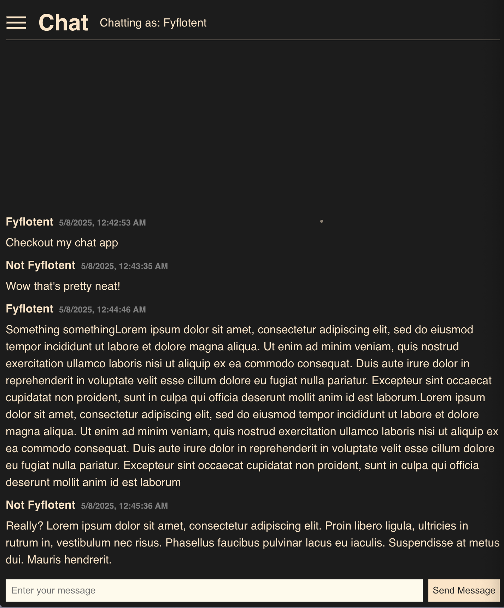

# Spacetime Chat App

Chat app to try out [SpacetimeDB](https://spacetimedb.com/home).

## Prequisites

- Install Rust (1.86.0)
- Install Node (v24)
- Install Spacetime CLI (1.1.1)

## Server

The server is a SpacetimeDB instance hosted on docker.

1. Run `docker compose up -d` from the git root directory.
2. Add the docker container as a host `spacetime server add self-hosted --url http://localhost:3000 --no-fingerprint`
3. Run `spacetime server set-default self-hosted` (Optional but following commands assume a default has been set)
4. `cd server` then run `spacetime publish quickstart-chat`

## Frontend Client

From the client directory:

1. `npm i`
   1. This also generates module bindings so ensure spacetime cli is installed first
1. Start the dev server with `npm run dev`
1. Open localhost:5173

## Check it out

